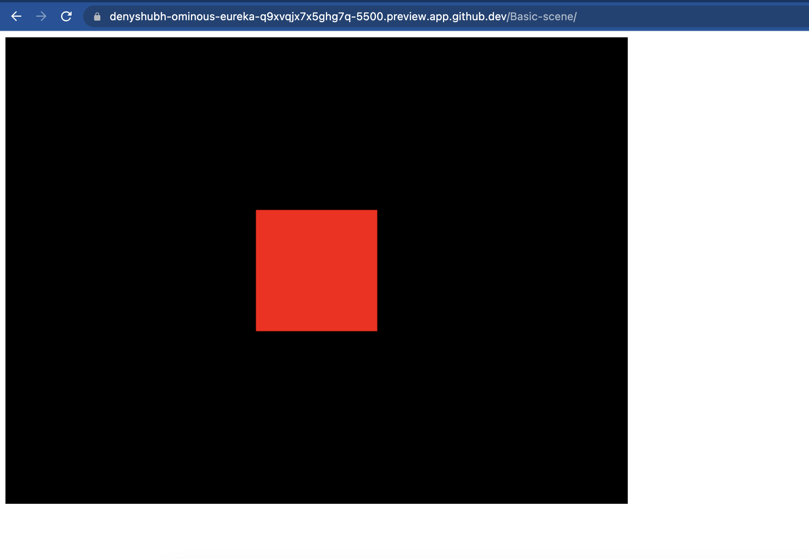

# Setup
To Run this code you need to downlod the three.js lib

#### STEPS:
- cd Basic-scene # (if you are not already in Basic-scene directory)
- wget https://github.com/mrdoob/three.js/archive/master.zip
- unzip master.zip

### Output
when you open the html file, you will be able to see something like below

